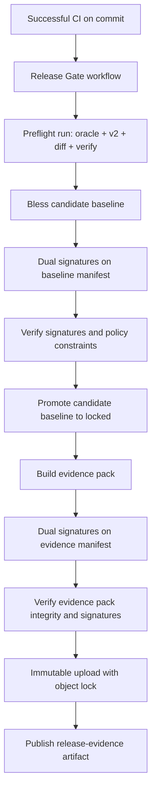
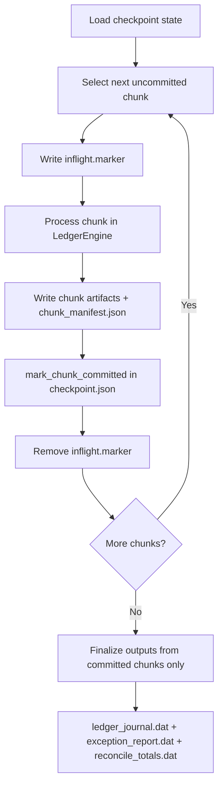

# COBOL Guard

COBOL Guard is a modernization assurance project that proves behavioral parity between:
- `v1` COBOL oracle behavior
- `v2` Python implementation

The repository enforces deterministic execution, schema-governed canonicalization, signed evidence, and release gates.

Note: on Windows PowerShell, `gm` may resolve to `Get-Member`. Use `python -m cobol_guard.harness.cli ...` commands.

## System Diagrams

### Behavioral Equivalence Harness

```mermaid
flowchart LR
  A[Case Fixture YAML] --> B1[Oracle Run<br/>python-reference | cobol-command | cobol-executable]
  A --> B2[V2 Run<br/>candidate engine or API]
  B1 --> C1[Oracle Artifacts<br/>ledger_journal.dat<br/>reconcile_totals.dat<br/>exception_report.dat]
  B2 --> C2[V2 Artifacts<br/>ledger_journal.dat<br/>reconcile_totals.dat<br/>exception_report.dat]
  C1 --> D[Diff Engine + Invariant Checks]
  C2 --> D
  D --> E[diff_report.json]
  D --> F[verify_report.json]
```

### Release Gate Promotion Flow



### Batch Checkpoint and Restart



## Quick Start

1. Install in editable mode:
```bash
python -m pip install -e .[dev]
```

2. Run the oracle and candidate against the sample case:
```bash
python -m cobol_guard.harness.cli run --target oracle --case fixtures/cases/basic.yml
python -m cobol_guard.harness.cli run --target v2 --case fixtures/cases/basic.yml
```

3. Diff two run directories:
```bash
python -m cobol_guard.harness.cli diff --baseline-dir runs/<oracle-run> --candidate-dir runs/<v2-run>
```

4. Verify gates:
```bash
python -m cobol_guard.harness.cli verify --baseline-dir runs/<oracle-run> --candidate-dir runs/<v2-run>
```

5. Run adversarial parity case (out-of-order + duplicates + malformed ops):
```bash
python -m cobol_guard.harness.cli run --target oracle --case fixtures/cases/adversarial.yml
python -m cobol_guard.harness.cli run --target v2 --case fixtures/cases/adversarial.yml
python -m cobol_guard.harness.cli diff --baseline-dir runs/<oracle-adversarial-run> --candidate-dir runs/<v2-adversarial-run>
python -m cobol_guard.harness.cli verify --baseline-dir runs/<oracle-adversarial-run> --candidate-dir runs/<v2-adversarial-run>
```

6. Run restart adversarial case with failure injection, resume, and parity verify:
```bash
python -m cobol_guard.harness.cli run --target v2 --case fixtures/cases/adversarial_restart.yml --run-id demo-restart --fail-after-chunks 2
python -m cobol_guard.harness.cli run --target v2 --case fixtures/cases/adversarial_restart.yml --run-id demo-restart --resume
python -m cobol_guard.harness.cli run --target oracle --case fixtures/cases/adversarial_restart.yml
python -m cobol_guard.harness.cli verify --baseline-dir runs/<oracle-restart-run> --candidate-dir runs/demo-restart
```

7. Run benchmark report:
```bash
python -m cobol_guard.harness.cli benchmark --case fixtures/cases/basic.yml --profile benchmark/profile.yml
```

8. Start the candidate API:
```bash
set COBOL_GUARD_DATABASE_URL=sqlite+pysqlite:///./cobol_guard.service.db
set COBOL_GUARD_AUTH_MODE=hs256
set COBOL_GUARD_JWT_HS256_SECRET=local-dev-secret
set COBOL_GUARD_JWT_ISSUER=cobol-guard-local
set COBOL_GUARD_JWT_AUDIENCE=cobol-guard-api
v2-api
```

Candidate API operational routes:
- `GET /healthz`: process liveness
- `GET /readyz`: database readiness
- `GET /metrics`: Prometheus metrics, requires `ops.metrics` scope when auth is enabled

Candidate API persistence + runtime model:
- the service persists request history, balances, and reconcile reports in the configured SQL database
- local development can use SQLite as shown above
- production deployments should set `COBOL_GUARD_DATABASE_URL` explicitly and treat the API as a stateful service, not an in-memory demo process

Candidate API auth + rate limit controls:
- supported auth modes: `disabled`, `hs256`, `jwks`
- JWT scopes: `ledger.read`, `ledger.write`, `ops.metrics`
- rate-limit env vars: `COBOL_GUARD_RATE_LIMIT_WRITE_RPS`, `COBOL_GUARD_RATE_LIMIT_READ_RPS`
- service bind defaults to `127.0.0.1:8000`; override with `COBOL_GUARD_SERVICE_HOST` and `COBOL_GUARD_SERVICE_PORT`
- when auth is enabled, business endpoints return structured JSON errors with `code`, `message`, and `request_id`

Generate a local HS256 token for smoke testing:
```bash
python -c "import jwt; print(jwt.encode({'sub':'local-user','scope':'ledger.read ledger.write ops.metrics','iss':'cobol-guard-local','aud':'cobol-guard-api'}, 'local-dev-secret', algorithm='HS256'))"
```

Example authenticated API calls:
```bash
curl -H "Authorization: Bearer <token>" http://127.0.0.1:8000/readyz
curl -H "Authorization: Bearer <token>" -H "Content-Type: application/json" ^
  -d "{\"request_id\":\"REQ1\",\"account_id\":\"ACC000000001\",\"amount_cents\":1000,\"business_date\":\"20260110\",\"event_time\":\"20260110120000\"}" ^
  http://127.0.0.1:8000/transactions/post
```

## Oracle Modes

- `python-reference` (default): in-process oracle implementation for local development.
- `cobol-command`: execute an external command that produces `oracle_result.json`.
- `cobol-executable`: compile/run `programs/v1/LEDGER01.cbl` with `cobc` and consume COBOL-produced fixed-width oracle artifacts directly.

Set external oracle mode:
```bash
set COBOL_GUARD_ORACLE_MODE=cobol-command
set COBOL_GUARD_ORACLE_COMMAND=python tools\\oracle_wrapper_reference.py --input "{input_jsonl}" --output "{output_json}" --business-date "{business_date}"
```

Required oracle command-template placeholders:
- `{input_jsonl}`
- `{output_json}`
- `{business_date}`
- optional: `{work_dir}`

Set direct COBOL executable mode:
```bash
set COBOL_GUARD_ORACLE_MODE=cobol-executable
set COBOL_GUARD_COBOL_SOURCE=programs\\v1\\LEDGER01.cbl
set COBOL_GUARD_COBOL_BUILD_DIR=build\\cobol
python -m cobol_guard.harness.cli run --target oracle --case fixtures/cases/basic.yml
```

`oracle_result.json` contract:
```json
{
  "journal": [ { "...": "JournalRecord fields" } ],
  "exceptions": [ { "...": "ExceptionRecord fields" } ],
  "totals": { "...": "ReconcileTotals fields" }
}
```

## Governance Controls

- `SPEC.md` is the normative source for domain contract, canonicalization, invariants, and re-bless process.
- `governance/gate_policy.yml` contains deterministic severity mapping and threshold gates.
- Ed25519 signatures are required for baseline promotion.

Generate signer keys:
```bash
python -m cobol_guard.harness.cli keygen --name approver_a
python -m cobol_guard.harness.cli keygen --name approver_b
```

Sign a manifest:
```bash
python -m cobol_guard.harness.cli sign-manifest --manifest baselines/candidate/basic/baseline_manifest.json --key governance/keys/approver_a.private.pem
```

Sign a manifest via cloud-KMS command template (no local private key):
```bash
python -m cobol_guard.harness.cli kms-sign-manifest \
  --manifest baselines/candidate/basic/baseline_manifest.json \
  --key-id release_signer_a \
  --command-template "<kms command that prints base64 signature>"
```

Promote candidate baseline to locked:
```bash
python -m cobol_guard.harness.cli promote-baseline \
  --manifest baselines/candidate/basic/baseline_manifest.json \
  --signature baselines/candidate/basic/baseline_manifest.approver_a.sig.json \
  --signature baselines/candidate/basic/baseline_manifest.approver_b.sig.json
```

Build a signed evidence pack archive:
```bash
python -m cobol_guard.harness.cli evidence-pack --pack-id v0.1 --include SPEC.md --include governance/gate_policy.yml --include schema-registry --include runs/<v2-run> --output-dir dist/evidence --retention-class regulated-7y --provenance-ref "ticket://REL-1234"
python -m cobol_guard.harness.cli sign-manifest --manifest dist/evidence/v0.1/evidence_manifest.json --key governance/keys/approver_a.private.pem
python -m cobol_guard.harness.cli sign-manifest --manifest dist/evidence/v0.1/evidence_manifest.json --key governance/keys/approver_b.private.pem
```

Use `.github/workflows/release-gate.yml` for controlled promotion from CI:
- requires a successful `CI` workflow run on the commit
- requires a passing benchmark report and enforces benchmark thresholds during release verification
- re-runs release verification
- enforces two valid Ed25519 signatures
- promotes candidate baseline only after gates pass
- builds and uploads a signed evidence pack artifact
- emits `release-evidence/preflight/release_control_attestation.json` to prove benchmark-enforced preflight inputs were captured
- emits `release-evidence/preflight/build_provenance.json` with commit/run metadata and hashes for the benchmark, diff, verify, and attestation artifacts
- captures release-time security evidence under `release-evidence/security/` (`pip_audit.json`, `bandit.json`, `sbom.json`, `security_summary.json`)
- `cloud_provider` input controls immutable storage and OIDC path (`gcp` default, `aws` optional)
- default signing mode is `kms-command` using:
  - `RELEASE_SIGNER_A_KMS_SIGN_COMMAND`
  - `RELEASE_SIGNER_B_KMS_SIGN_COMMAND`
- immutable evidence upload configuration:
  - `IMMUTABLE_EVIDENCE_BUCKET` (or workflow input `immutable_bucket`)
  - optional `IMMUTABLE_EVIDENCE_PREFIX` (or workflow input `immutable_prefix`)
  - GCP OIDC: `GCP_WORKLOAD_IDENTITY_PROVIDER`, `GCP_SERVICE_ACCOUNT`, optional `GCP_PROJECT_ID`
  - AWS OIDC (optional path): `AWS_ROLE_TO_ASSUME`, `AWS_REGION`
- PEM fallback mode secrets:
  - `RELEASE_SIGNER_A_PRIVATE_KEY_PEM`
  - `RELEASE_SIGNER_B_PRIVATE_KEY_PEM`
- optional fallback secrets if public keys are not committed: `RELEASE_SIGNER_A_PUBLIC_KEY_PEM`, `RELEASE_SIGNER_B_PUBLIC_KEY_PEM`
- standard tracked public keys: `governance/keys/release_signer_a.public.pem`, `governance/keys/release_signer_b.public.pem`
- include `immutable_bucket` input or set `IMMUTABLE_EVIDENCE_BUCKET`; workflow uploads signed pack zip with object lock and emits `release-evidence/immutable/immutability_proof.json`

Verify any signed manifest (baseline or evidence pack):
```bash
python tools/verify_signed_manifest.py \
  --manifest dist/evidence/v0.1/evidence_manifest.json \
  --signature dist/evidence/v0.1/evidence_manifest.release_signer_a.sig.json \
  --signature dist/evidence/v0.1/evidence_manifest.release_signer_b.sig.json \
  --keys-dir governance/keys \
  --min-valid 2 \
  --require-key-id release_signer_a \
  --require-key-id release_signer_b
```

Verify evidence-pack integrity + signatures:
```bash
python -m cobol_guard.harness.cli verify-evidence-pack \
  --pack-dir dist/evidence/v0.1 \
  --signature dist/evidence/v0.1/evidence_manifest.release_signer_a.sig.json \
  --signature dist/evidence/v0.1/evidence_manifest.release_signer_b.sig.json \
  --keys-dir governance/keys \
  --min-valid 2 \
  --require-key-id release_signer_a \
  --require-key-id release_signer_b
```

Dispatch a full release-gate run and download golden evidence artifact:
```bash
python tools/run_release_gate.py \
  --ticket REL-1001 \
  --risk-statement "first golden production evidence run" \
  --author release-bot \
  --evidence-pack-id v0.1 \
  --cloud-provider gcp \
  --signing-mode kms-command
```

Notes:
- `tools/run_release_gate.py` requires GitHub CLI (`gh`) to be installed and authenticated for the target repository.
- the dispatcher enforces enterprise workflow inputs by default and fails fast if the remote branch still has a legacy `release-gate.yml`.
- use `--allow-legacy-workflow` only for temporary triage while migrating older branches.
- `promote-baseline` and `evidence-pack` refuse to overwrite existing targets by default; pass `--force` only for intentional local reruns.

## Repository Layout

- `SPEC.md`: system contract and control policy narrative.
- `schema-registry/`: schema authority and canonical byte encoding rules.
- `benchmark/profile.yml`: reproducible benchmark profile.
- `governance/`: keys and gate policy.
- `fixtures/`: deterministic sample inputs and case definitions.
- `src/cobol_guard/`: harness, candidate service, oracle adapter, governance logic.
- `.github/workflows/ci.yml`: test and gate automation.
- `.github/workflows/ci.yml` also contains scheduled/manual performance gate runs, uploads CI evidence artifacts (`run_manifest`/`diff_report`/`verify_report`/benchmark report), and enforces a GnuCOBOL `cobol-executable` parity + determinism gate.
- `.github/workflows/ci.yml` includes a packaging-proof job that builds wheel/sdist, smoke-installs both, and emits `ci-evidence/packaging/packaging_proof.json` plus dependency inspection output.
- `.github/workflows/ci.yml` includes a service-proof job that runs the persistent candidate service tests and publishes `ci-evidence/service/live_service_smoke.json`.
- `.github/workflows/ci.yml` includes a security-proof job that publishes `pip_audit.json`, `bandit.json`, `sbom.json`, and summary artifacts.
- `.github/workflows/ci.yml` emits `ci-evidence/packaging/build_provenance.json` alongside packaging proof.
- `.github/workflows/ci.yml` keeps dependency and static-analysis evidence as review artifacts first; current findings are published even when they still represent backlog rather than enforced release blockers.
- `.github/workflows/ci.yml` builds wheel/sdist artifacts, smoke-installs them, and publishes packaging/dependency proof reports.
- `.github/workflows/ci.yml` contains a policy guard that fails if `release-gate.yml` default signing mode drifts from `kms-command`.
- `.github/workflows/release-gate.yml`: gated baseline promotion workflow with CI-success precondition, dual-signature enforcement, and signed evidence pack export.
- `RELEASE_CHECKLIST.md`: runbook for release promotion, evidence verification, and release publication.
- `docs/WORKLOAD_IDENTITY.md`: OIDC + KMS setup for AWS/GCP/Azure and command-template examples.
- `tests/`: core behavioral and control tests.
